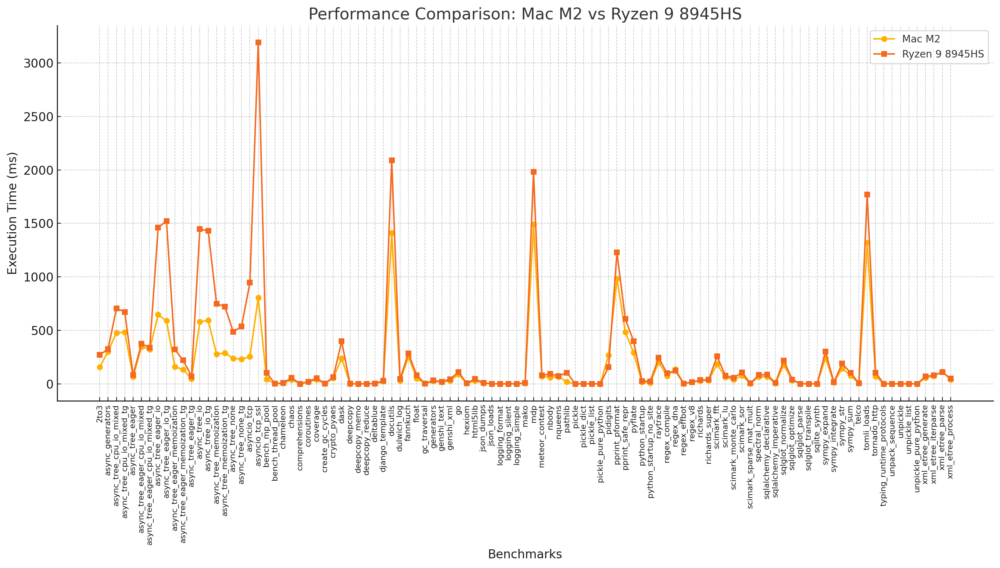
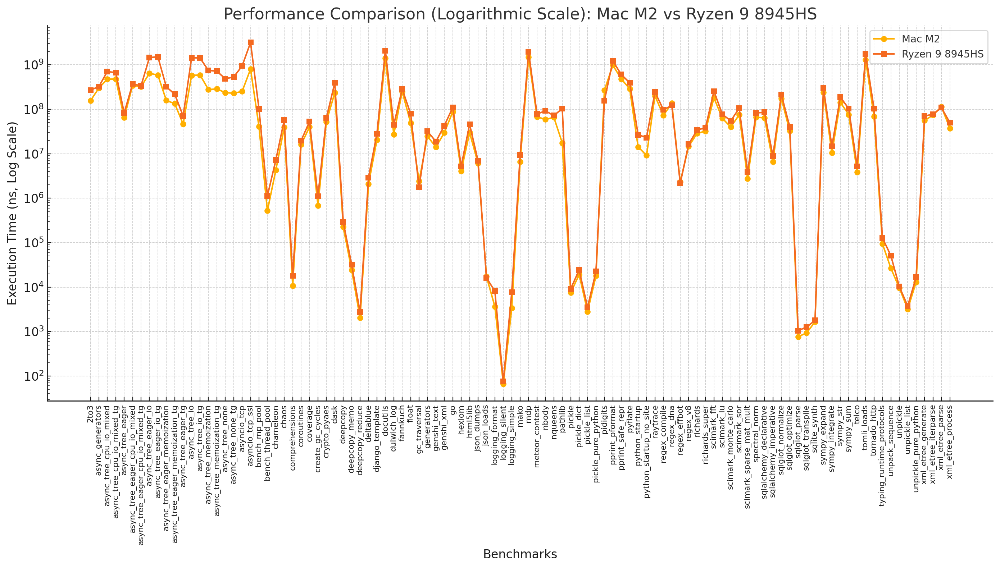

# pyperformance-comparism
Comparism of pyperformance Macbook M2 Max vs Ryzen 9 8945HS

pyperformance https://github.com/python/pyperformance

Chart in ms and linear scale

Chart in ms and logarithmic scale

Both charts were created by chatgpt from textual results.

[Textual comparism results](macm2max_vs_ryzen_8945hs.txt)

[pyperformance results of M2](macm2max.json)

[pyperformance results of Ryzen](ryzen9_8945hs.json)

